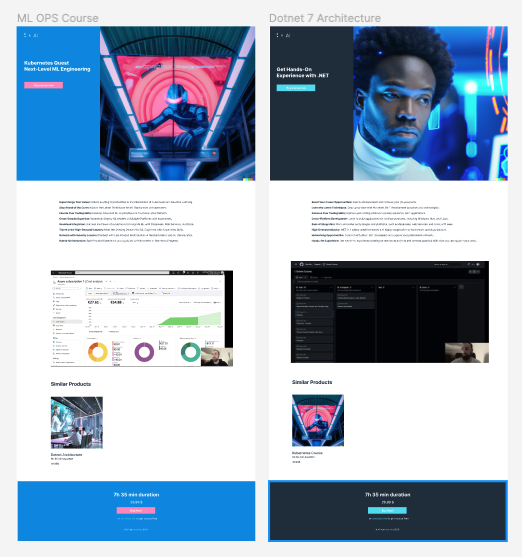

Repository for promoting educational products hosted on udemy platform.

<b>Technologies:</b> Nest.js, Vercel, React, Dalle3, ChatGPT.

<h2>Get Hands-On Experience with .NET </h2>

Time: 1Q 2023
15 sections • 86 lectures • 9h 59m total length

<b>Landing:</b> https://course-page-mu.vercel.app/

<b>Course:</b> https://www.udemy.com/course/net-7-architecture/?kw=Dotnet+7&src=sac

<h2>Kubernetes Quest Next-Level ML Engineering</h2>

Time: May & June 2023

Work in Progress

<b>Landing:</b> https://course-page-1u5i.vercel.app/

<b>Course:</b> WIP
